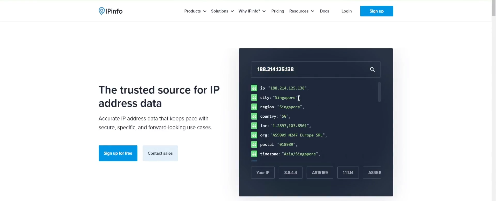
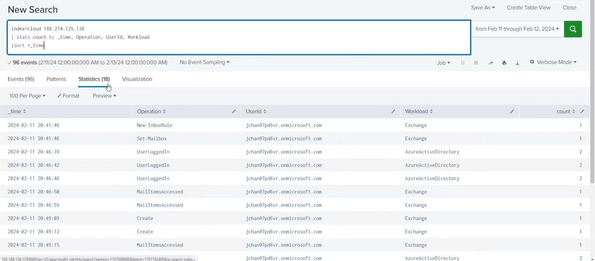
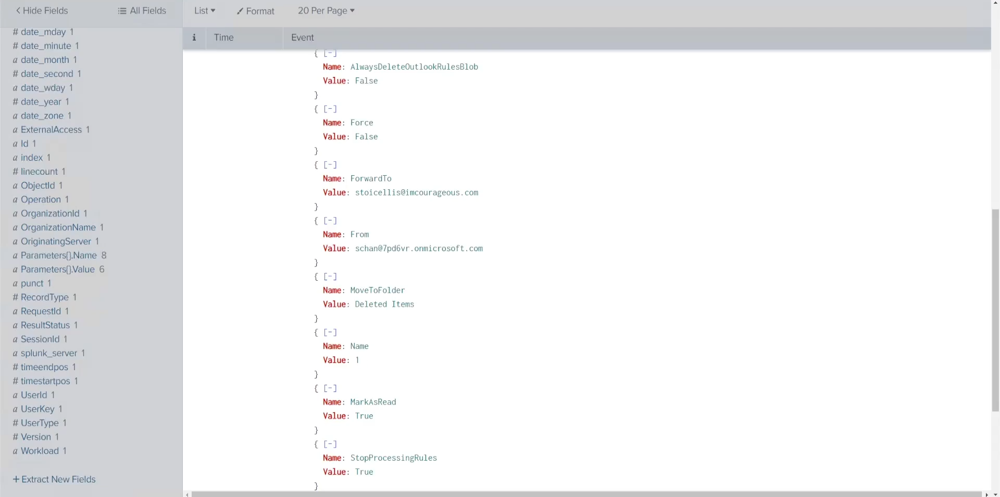
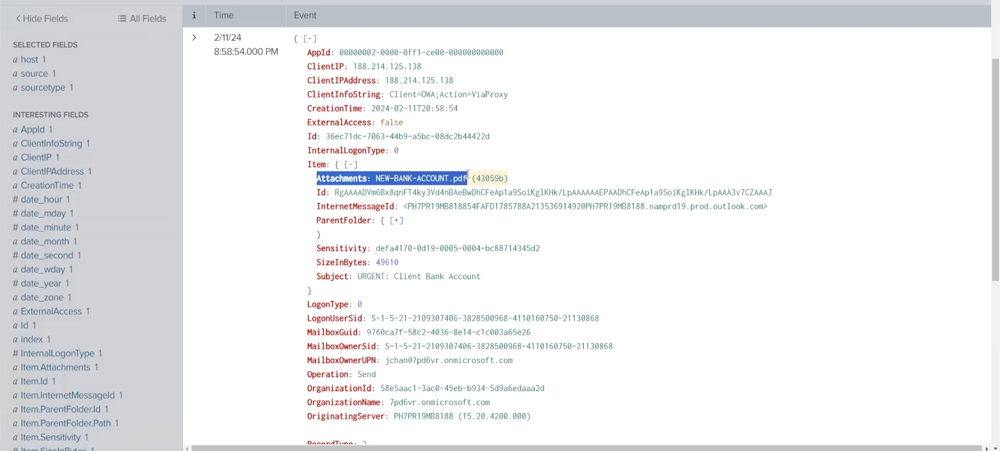
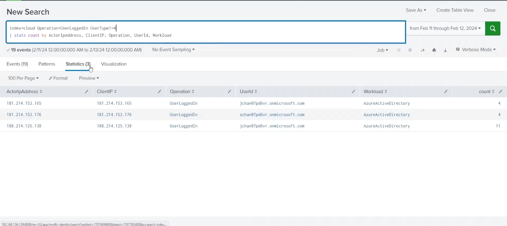
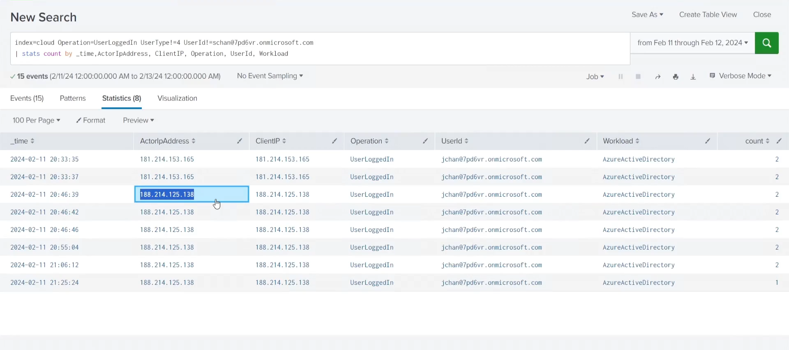

# 📸 Investigation Evidence – Screenshots

This directory contains **screenshots** supporting the *Impossible Travel / Unfamiliar Sign-In* and *Business Email Compromise (BEC)* investigation documented in this repository.

Each screenshot directly supports a specific investigation question or conclusion.  
No screenshots are exploratory or redundant.

**All timestamps shown are in UTC.**

---

## 🧭 How to Read This Folder

The screenshots are ordered to reflect the **attacker lifecycle** observed during the investigation:

1. Suspicious authentication
2. Geographic anomaly validation
3. Post-authentication persistence
4. Email reconnaissance
5. Fraud execution
6. Attacker cleanup
7. Scope validation
8. Timeline reconstruction

A reviewer can understand the full incident without opening every image.

---

## 📂 Screenshot Index and Evidence

### 01. Unfamiliar Login
**File:** `01-unfamiliar-login.png`

**What it shows:**
- Successful login for `jchan@7pd6vr.onmicrosoft.com`
- Source IP `188.214.125.138`
- Login time `2024-01-11 20:46:39 UTC`
- Azure Active Directory workload

**Why it matters:**  
Establishes the initial suspicious authentication event.

---

### 02. IP Geolocation (OSINT)
**File:** `02-ip-geolocation.png`

**What it shows:**
- OSINT enrichment confirming IP `188.214.125.138` geolocates to **Singapore**

**Why it matters:**  
Validates impossible travel for a Canada-based user.

---

### 03. Mailbox Rule Creation
**File:** `03-mailbox-rule-creation.png`

**What it shows:**
- Audit log evidence of `New-InboxRule` operation
- Action originating from the attacker IP

**Why it matters:**  
Demonstrates attacker persistence after authentication.

---

### 04. Mailbox Rule Details
**File:** `04-mailbox-rule-details.png`

**What it shows:**
- Full inbox rule configuration
- Emails from `schan@7pd6vr.onmicrosoft.com` forwarded to `stoicellis@imcourageous.com`
- Messages marked as read and moved to Deleted Items

**Why it matters:**  
Confirms malicious mailbox manipulation consistent with BEC tradecraft.

---

### 05. Email Subject Distribution
**File:** `05-emails-subject-distribution.png`

**What it shows:**
- Aggregated analysis of email subject fields observed during the attacker session
- Presence of the following subjects:
  - “RE: First Invoice of the month!”
  - “URGENT: Client Bank Account”

**Why it matters:**  
Provides subject-level context for emails interacted with during the compromised session and supports identification of financially themed messages later confirmed through direct audit events.

---

### 06. Fraudulent Email Sent
**File:** `06-email-sent.png`

**What it shows:**
- `Send` operation from the compromised mailbox
- Subject: “URGENT: Client Bank Account”
- Attachment: `NEW-BANK-ACCOUNT.pdf`

**Why it matters:**  
Confirms Business Email Compromise execution.

---

### 07. Draft Email Deleted
**File:** `07-draft-deleted.png`

**What it shows:**
- `MoveToDeletedItems` operation
- Draft email “Re: First Invoice of the month!” deleted from Drafts

**Why it matters:**  
Indicates attacker cleanup and anti-forensic behavior.

---

### 08. IP Correlation and Scope Validation
**File:** `08-ip-correlation-check.png`

**What it shows:**
- IP-centric authentication correlation
- IP `188.214.125.138` associated only with `jchan@7pd6vr.onmicrosoft.com`
- No other accounts observed authenticating from this IP

**Why it matters:**  
Confirms the compromise scope was limited to a single account.

---

### 09. Activity Timeline
**File:** `09-activity-timeline.png`

**What it shows:**
- Chronological reconstruction of all attacker actions
- Activity window from `20:41:46` to `20:58:54 UTC`

**Why it matters:**  
Provides an end-to-end view of the incident lifecycle.

---

## ✅ Evidence Integrity Statement

- All findings are supported by logged events
- No assumptions or speculative conclusions
- Each investigation claim maps to at least one screenshot in this folder
- Screenshots were selected to maximize clarity and minimize noise

---

## 👀 Reviewer Note

This folder is structured to mirror how SOC teams document and review incident evidence internally.  
A hiring manager or analyst can quickly assess investigation quality without opening every artifact.
